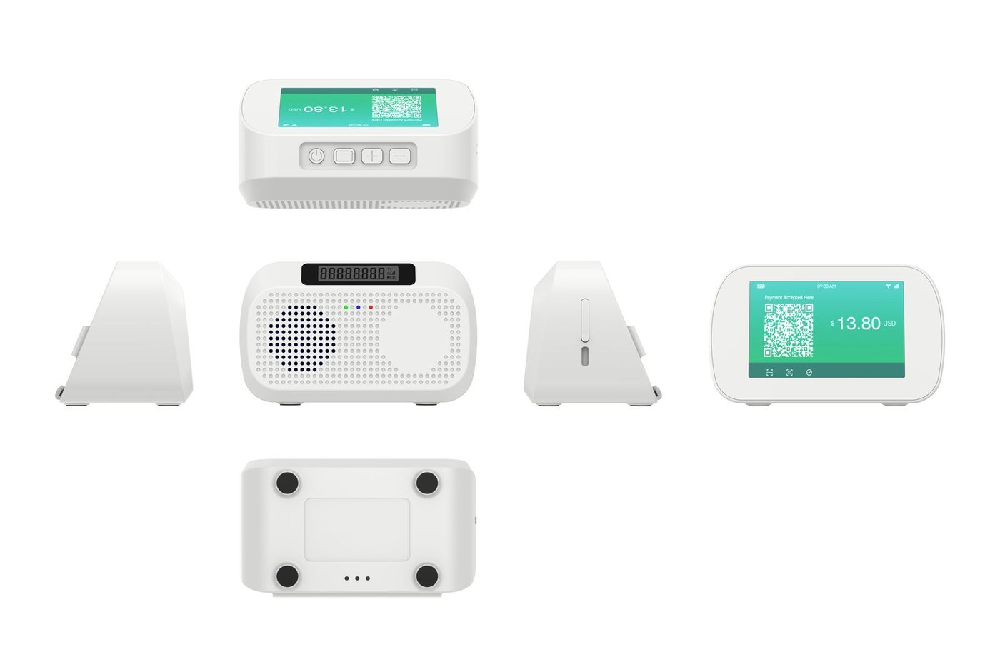
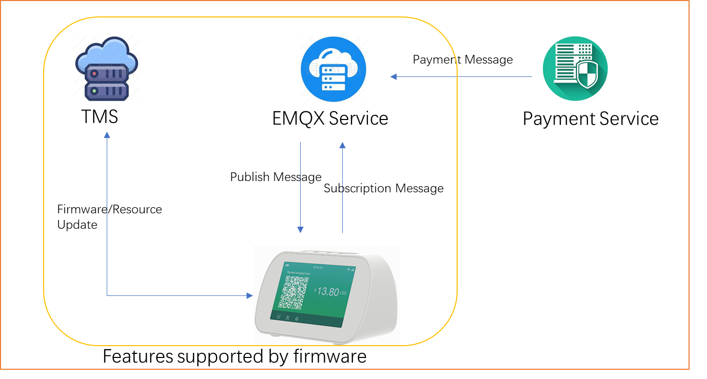

# DS10 Guidance

## Overview

The DS10 is an embedded IoT project based on Quectel wireless communication modules, primarily used for intelligent voice interaction, network connectivity, and data transmission. 



## Features

- **OTA**:The device supports OTA function.Firmware and resources can be updated through OTA.

- **Voice Broadcast**:Support subscribing to MQTT server's broadcast messages. Supports playing audio files in MP3 and WAV formats

- **Network Management**:The device supports connecting to MQTT servers through wireless networks or WIFI.

- **LCD Display**:If the device supports an LCD display screen, it can display the static or dynamic QR code.

- **Digital Display**:If the device supports a digital screen, it can display the current time and amount.

- **Multi-LED Indicators**: Red,Blue and Green LED indicators for device status feedback.

## Demonstrate

If you want to demonstrate device broadcasting, [click here](https://github.com/DspreadOrg/DS10/blob/main/doc/How%20to%20demonstrate%20device%20broadcasting.md) or contact dspread for guidance.

## Quick Start

Below is a diagram of the DS10 Firmware,TMS,EMQX and payment system.



The default firmware installed on the device  supports connecting to the tms and emqx test servers of dspread.If the default firmware meets your business needs, you only need to do is update your MQTT server parameters through OTA.

[Click here to learn how to update parameters via OTA](https://github.com/DspreadOrg/DS10/blob/main/doc/How%20to%20connect%20to%20your%20server.md)

1.The default firmware subscribe topic is "**user/message/DS10DCN000001**". "DS10DCN000001" is the device serial number.

2.The default subscribe message fomart:

```
{ "status": "success","orderId":"12345677","amount":1234.56 }
```

## Custom Firmware

### Project introduction

The project is built on the ThreadX real-time operating system and integrates dual-mode communication capabilities for 4G LTE and WiFi, featuring rich audio processing functions.

### Project Architecture

```
DS10/
├── demo/                 # Main demonstration application
│   ├── ql-application/   # Application layer code
│   │   └── threadx/      # ThreadX real-time operating system application
│   │       ├── common/   # Common libraries and header files
│   │       ├── config/   # Configuration files
│   │       └── evb_audio/ # Main application code (audio version)
│   ├── ql-config/        # Project configuration
│   └── ql-cross-tool/    # Cross-compilation toolchain
├── doc/                  # Documentation
│   ├── API.xlsx          # API interface table
│   ├── DS10 API.docx     # API detailed documentation
│   ├── How to use wifi.md # WiFi usage instructions
│   ├── How to create ota package.docx # TMS usage instructions
│   └── project build.md # Project build documentation
└── tool/                 # Tools
```

### Project Build

1. Clone project code.Note that the project path cannot contain spaces.

2. Configure the compilation environment.

3. Configure the type of equipment according to the equipment model in the reengineering.

4. Start building.

5. Download Firmware with windows tool.
   
   [Click here to get more details](https://github.com/DspreadOrg/DS10/blob/main/doc/project%20build.md)