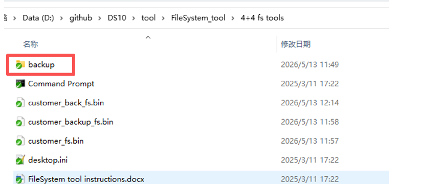
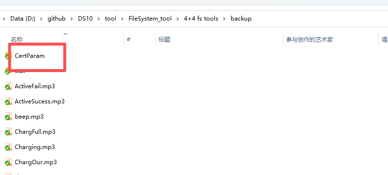
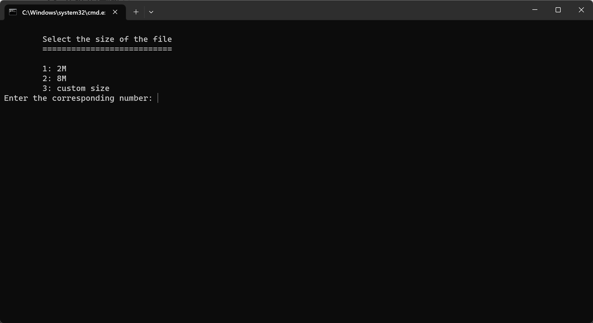
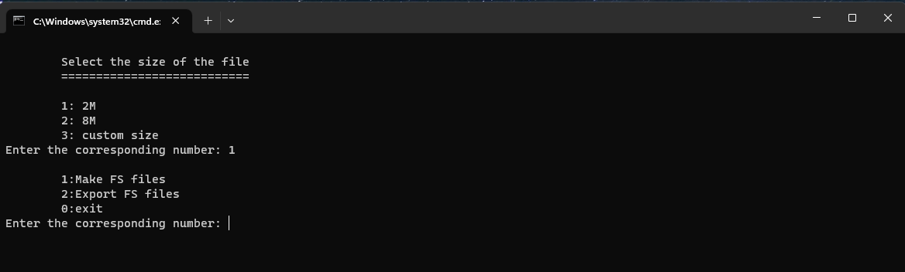
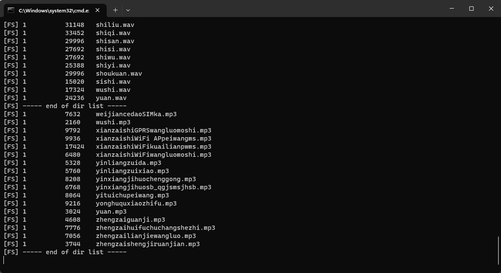
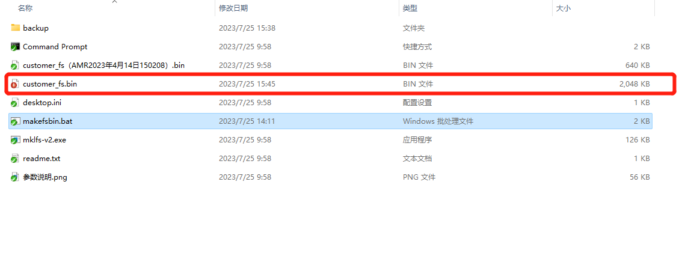
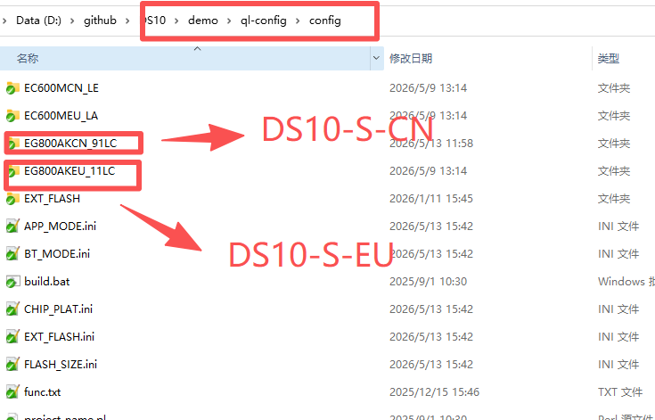
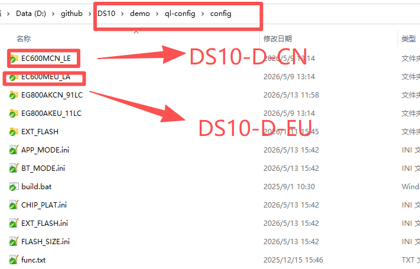
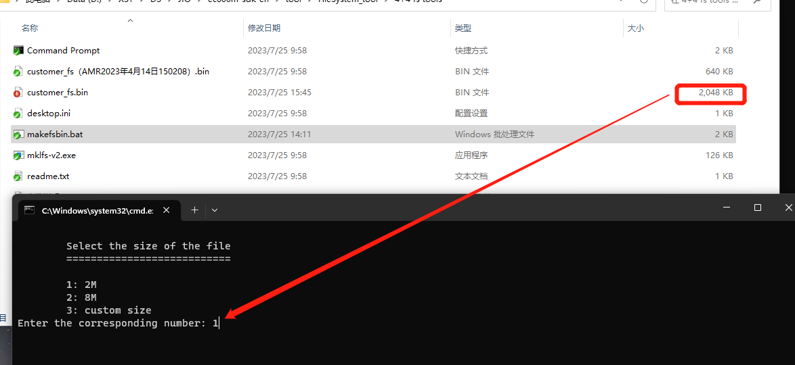
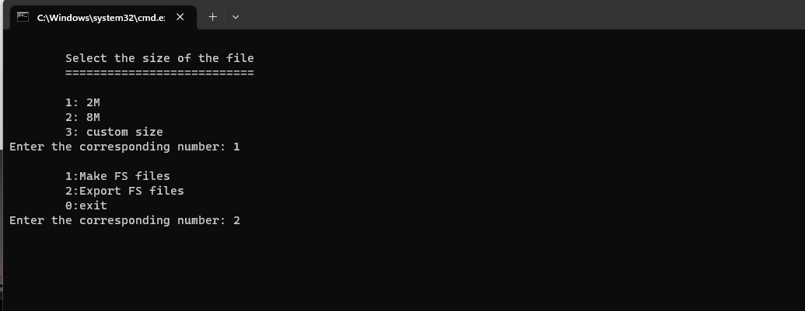

# How to create file system

## Introduction

The device supports file systems The file system is used to store resource files used by firmware The resource files include audio files and parameter files for broadcasting
Audio files and parameter files can be pre fabricated into the device by generating file system files

## File naming for file systems

custom_fs.bin for DS10-S-EU and DS10-S-CN.

custom_backup_fs.bin forDS10-D-EU and DS10-D-CN.

## FileSystem_tool

- backup folder

All your resource files need to be placed in this directory.
For example, if you want to pre create some configuration files and certificates into the file system. You can create folders in the backup and place these files in a new folder.

In this directory, you can customize your parameter files and certificate files.

## FS file generate

1. Put your resource files in the backup directory.

2. Double click the makefsbin.bat file
   
   

3. Select the 2M or 8M file system that you want to make (option 3 not support)
   
   2M for DS10-S-EU and DS10-S-CN.
   
   8M for DS10-D-EU and DS10-D-CN.
   
   

4. After that, we choose the 1st option, make the FS file, and  the customer _fs.bin is the FS file that is produced
   
   

## Update FS file

When we creating a file system,If select Option 1, A 2MB customer_fs. bin file will be generated. This file can be used on both DS10-S-CN and DS10-S-EU devices. Neither of these devices has a display screen
We need to place the generated customer _fs. bin file in the following directory

If select Option 2, A 8MB customer_fs. bin file will be generated. We need to rename this file as' **custom_mackup_fs. bin** '.The new file can be used on both DS10-D-CN and DS10-D-EU devices. These two devices have lcd screen
We need to place the generated customer_backup_fs. bin file in the following directory.

## Export files from FS file

1. Change the file name of the FS file to be exported to customer_fs.bin.

2. Run the script and select or enter “customer_fs.bin” file size（Choose according to the actual file size. we choose 1 on demo）
   
   

3. After confirmation, select option 2 to export the file
   
   

4. The exported file will be saved to the backup folder.

