# How to create ota package

## Explanation

Generating an OTA package requires three important files

- **resource.json**
  
  This file is a configuration file and does not require manual modification.

- **Package script**
  
  package_resource.ps1/package_firmware.ps1 This is a script file that runs on PowerShell

- **Original File:**
  
  **Fireware Original File**: Firmware_Version.bin
  **Cert and Param Original File**:: CertParam_Version.zip
  **Voice Original File**:: Voice_Version.zip
  
  **The version number is required when naming the file above. The file suffix type should be consistent**

## Create OTA firmware package

- Place the bin file generated in step 4 of project-build.bat into the ../tms/firmware directory and modify the file name as required.
  
  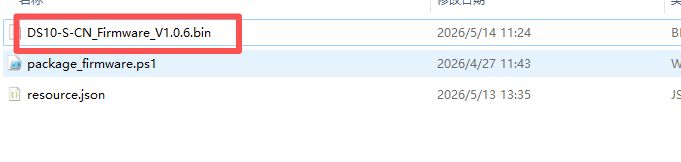

- Open PowerShell and run package_firmware. ps1. The script requires three parameters to be entered.
  
  1.Original files that need to be packaged
  
  2.Device Mode
  
  3.Customer Name
  
  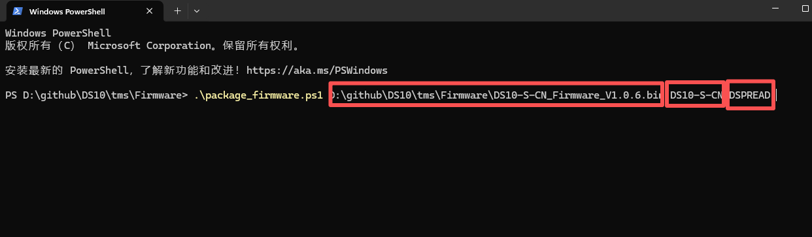

- After completing the parameter input, press enter to execute the script, which will automatically generate an OTA firmware package that can be uploaded to the TMS system.

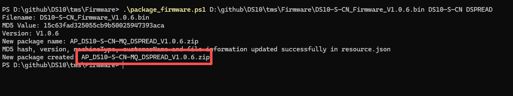

- **AP_DS10-S-CN-MQ_DSPREAD_V1.0.6.zip** It is a generated OTA firmware package that can be uploaded to the TMS system for updating device firmware.

## Create Cert and Param OTA package

- About param file <tms/CertParam/ ResourceFile/posparam.ini><json>

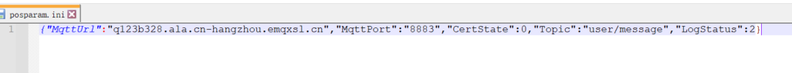

The following is a list of parameters that support remote updates

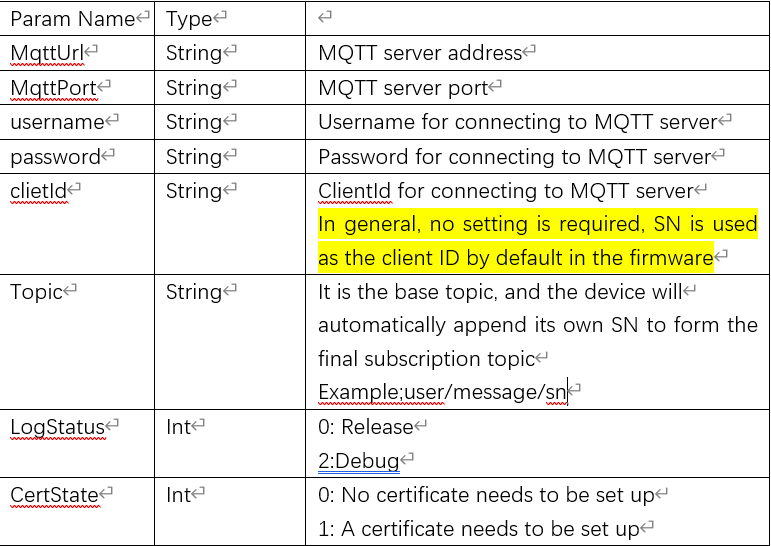

If set CertState with 0,
posparam.in file is needed to create CertParam_V1.0.6.zip

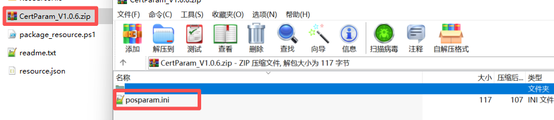

Please note that the zip file only contains the posparam.ini file. 

If set CertSate with 1 posparam.iniand cert files are needed to create CertParam_V1.0.6.zip

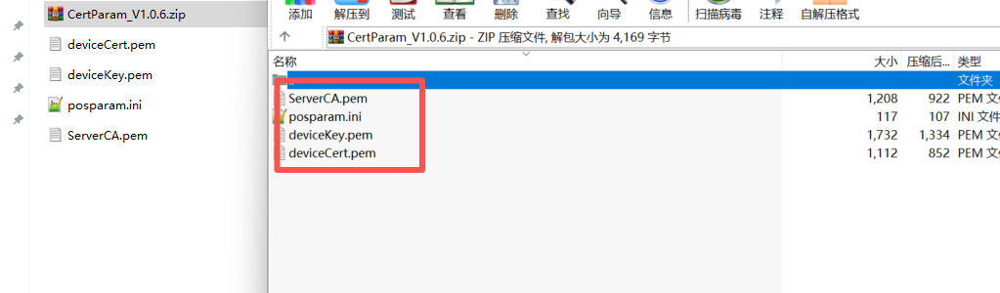

- Open powershell and run ./CertParam/package_resource.ps1.
  
  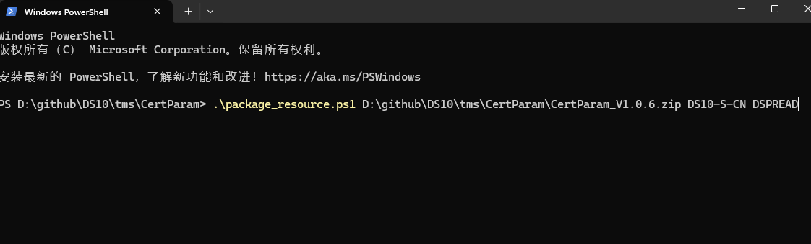

- Create Cert and Param OTA package.
  
  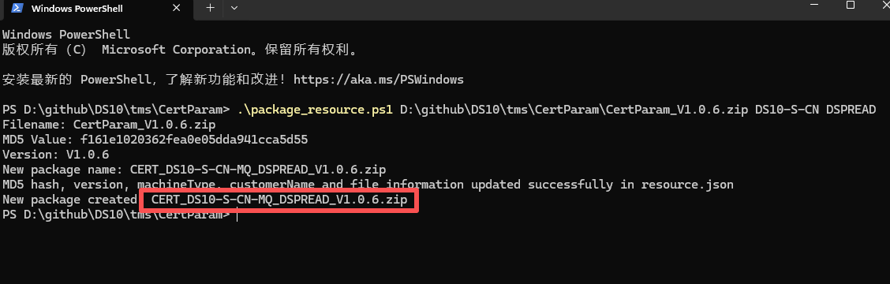

## Create Voice OTA package

The device supports updating played voice files through TMS. Support single file and batch file updates.

- Orignal voice files: tms/VoiceResource/voice
  
  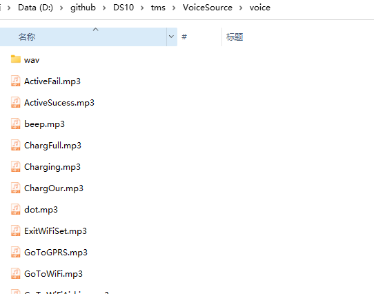

- Create Voice Original files, map3 and wav files are needed to create  VoiceResource_V1.0.6.zip
  
  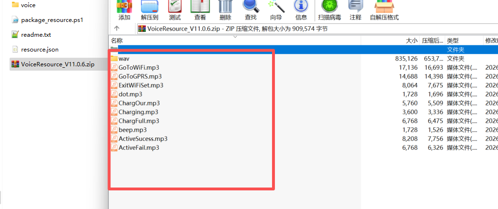

- Open powershell and run package_resource.ps1
  
  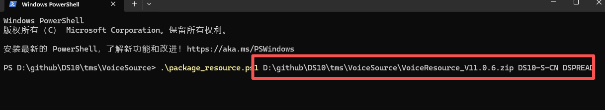
  
  Create Voice OTA package
  
  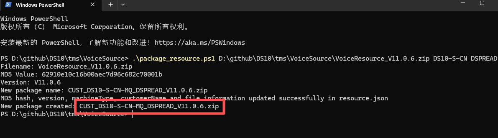

## How to use tms to update?

[Click here to get more details](https://github.com/DspreadOrg/DS10/blob/main/doc/How%20to%20use%20tms.md)
