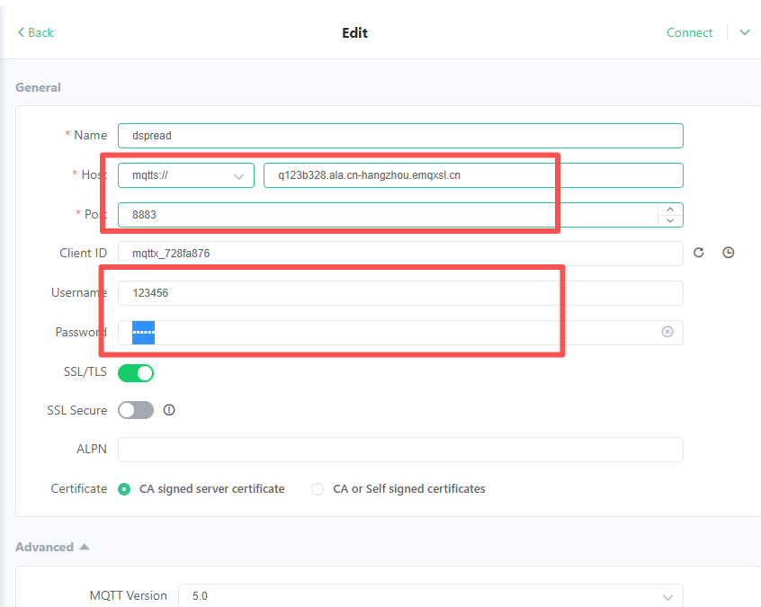
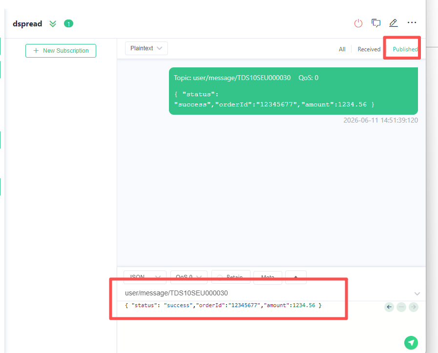

# How to demonstrate device broadcasting

## Introduction

The firmware installed on the device defines a fixed format for themes and subscription message formats. Default connection to the tms and emxq mqtt server of dspread.
You can use any MQTT testing tool to connect to the DSPREAD MQTT server. 

## Device networking

The device supports two ways to connect to the network: wireless network and WIFI.

[How to connect network with wifi?](https://github.com/DspreadOrg/DS10/blob/main/doc/How%20to%20use%20wifi.md)

## Demonstration broadcast

Taking MQTTX tool as an example, explain the connection method.[download](https://mqttx.app/)

- Config Param
  
      MqttServer: mqtts:// q123b328.ala.cn-hangzhou.emqxsl.cn
      ServerPort: 8883
      Client ID: your device sn
      UerName:123456  
      Password:******   Please contact dspread for password.



- Topic and Message

Topic: 

```
user/message/TDS10SEU000030
```

Please note that TDS10SEU000030 is the device serial number, you need to modify it to your device serial number.

Message Format:

```
   { "status": "success","orderId":"12345677","amount":1234.56 }
```

Please note that orderId cannot be duplicated.


