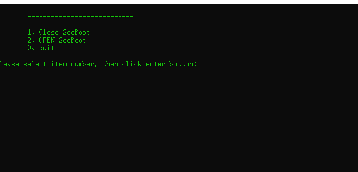
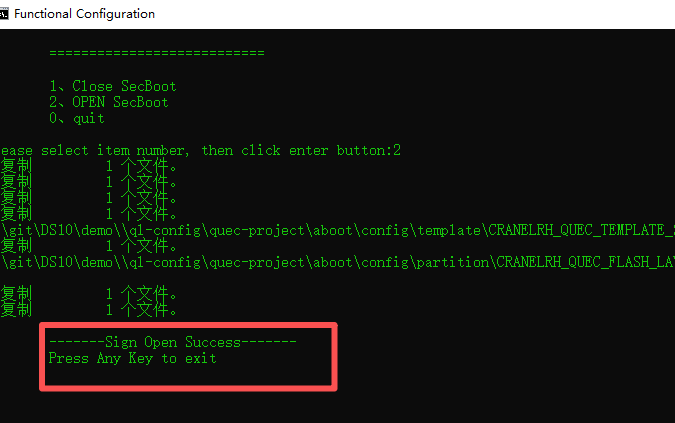

# How to open the signature function

## Precautions

Please note that during the development and debugging phase, do not enable the signature function. After the development and debugging are completed Enable the signature function again.After the signature function is turned on, it only supports updating the signed firmware.

## Generate signature certificate

Please contact technical support personnel to obtain the certificate.The certificate includes boot certificate and APP certificate.

**Please note that the certificate in the engineering demo is the default certificate for the DSPREAD prototype.**

## Update certificate

Please replace the existing engineering certificate with the new APP certificate obtained. App certs directory is : **DS10\demo\ql-cross-tool\sign\\****
Please replace the existing engineering certificate with the new BOOT certificate obtained. Boot certs directory is 

**DS10\demo\ql-config\quec-project\aboot\config\security\key\\****

## Open the signature function

1. Run “secboot.bat”
   
   
   
   Select 2 option to open signature function
   
   
