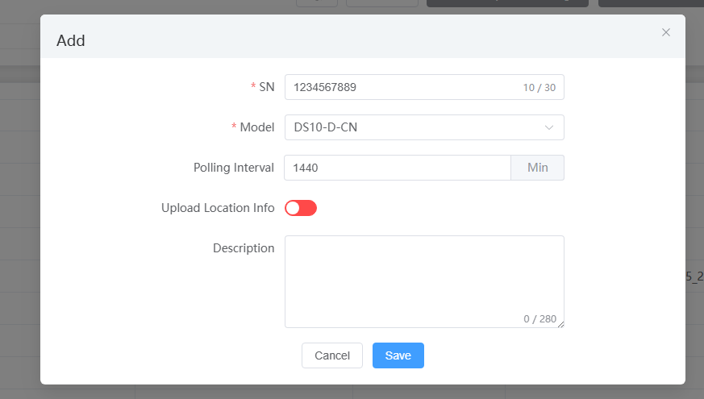
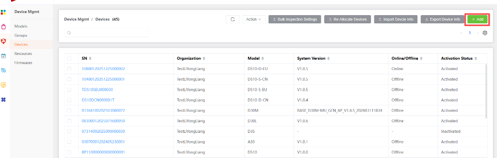
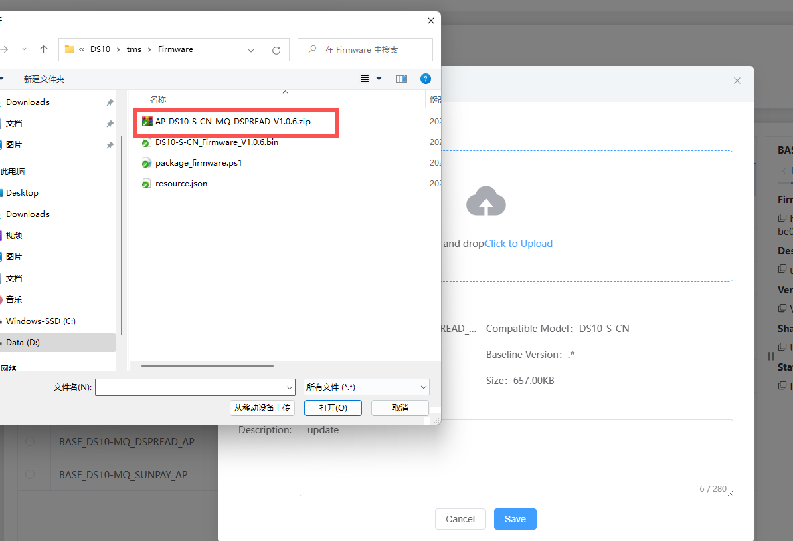
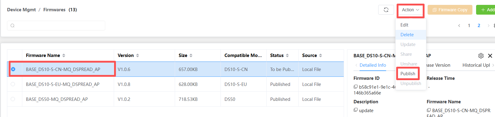
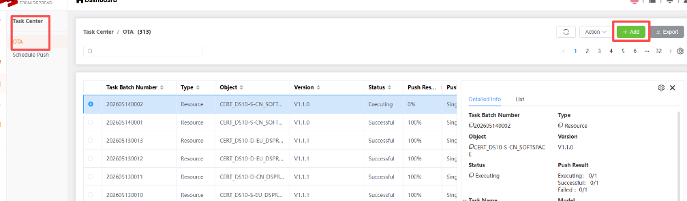
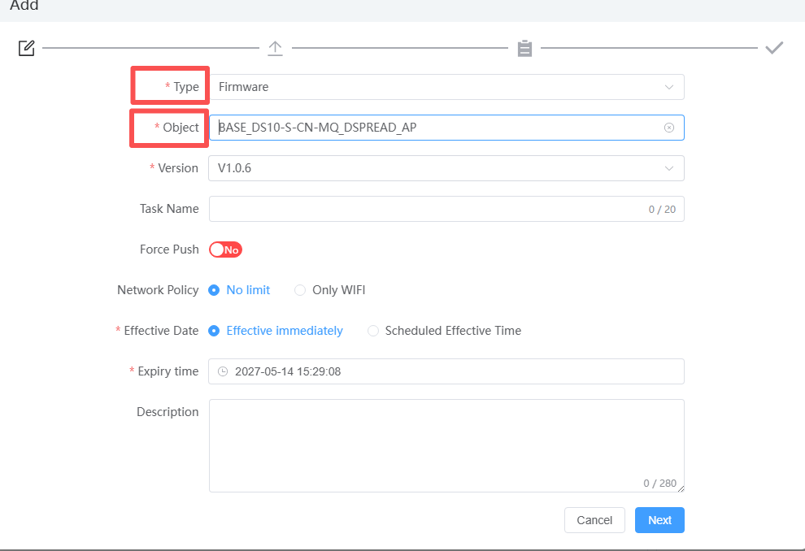
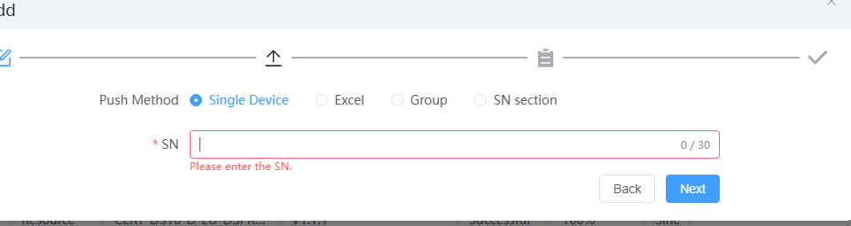
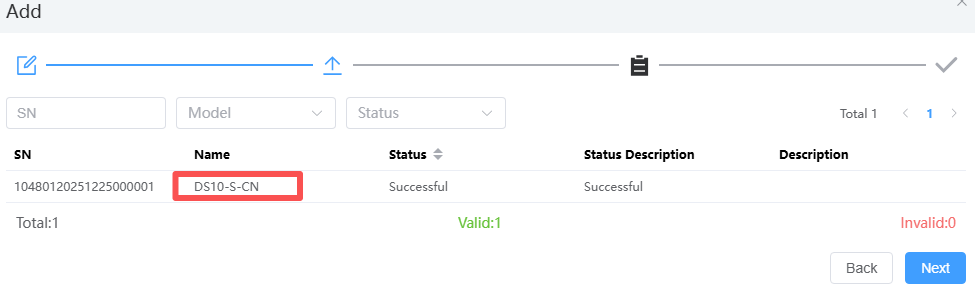
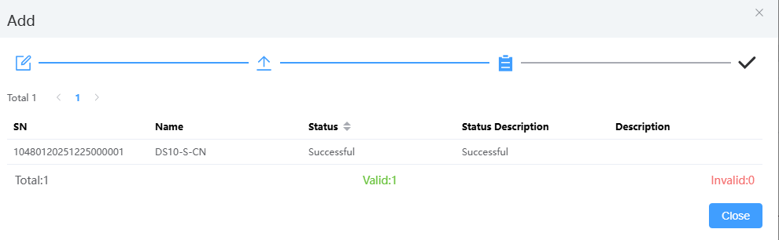
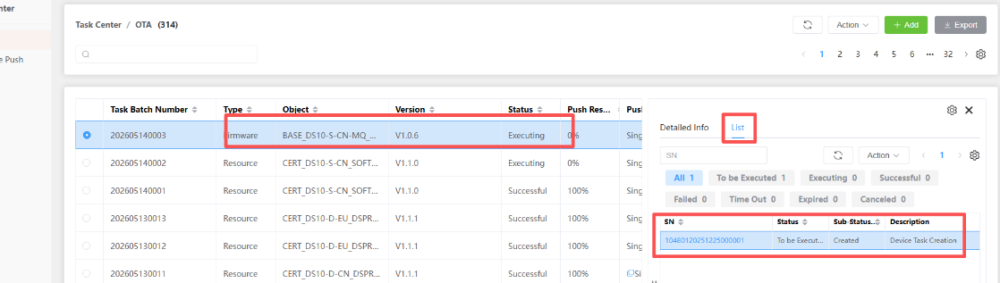

# How to use TMS

## Login to TMS

Please contact the technical support personnel of dspread to obtain a login address and apply for a login account.[Login Tms](https://www.dspreadser.net:9010)

## Register device

1. Enter menu  Device Mgmt->Devices

2. Click Add button
   
   

3. Input Sn and select device model, then click Save button
   
   

## Upload Firmware OTA package

1. Enter Menu: Device Magmt->Firmwares

2. Click Add button
   
   

3. Upload Firmware OTA package
   
   

4. Publish the firmware package that was just uploaded
   
   

## Upload Param and Voice OTA package

1. Enter Menu: Device Magmt->Resources

2. The other steps are basically the same as  upload ota firmware package

## Push update Task

1. Enter Menu: Task Center->OTA

2. Click Add button
   
   

3. Select the task Type and Object
   
   
   
   if the type is Resource, the Object contain Cert_DS10-  and Cust_DS10-. Cert Selection is Param task. Cust select is Voice task.

4. Click Next button
   
   

5. Input sn and click Next button
   
   

6. Click Next button and close button. The task create successful.
   
   

7. You can check the task status.
   
   

**The above is just a demonstration of push notifications for a single device. The system also supports batch device push tasks. Arrange tasks and other functions,please refer to the online guidebook for detailed job functions**
