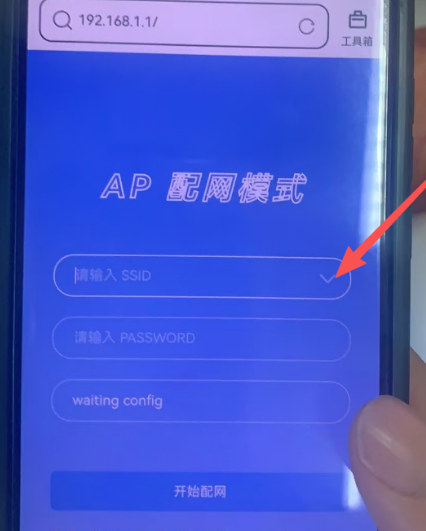

# How to use WiFi

Your device must support WIFI mode

## WiFi Setting

1. After the device is turned on, long press the function key will display the Connect wifi... , the device will enter the WIFI configuration state.

2. Double click the function key to enter AP configuration mode

3. Search for hotspots emitted by devices using mobile phones(DS10AP)

4. Enter 192.168.1.1 in the browser to configure the network

5. The browser will display the following interface
   
   

6. Click on the icon indicated by the red arrow. The browser will list the currently available WIFI hotspots. Select the WIFI hotspot you want to connect to and enter the password.

7. After entering the password, click the confirm button below to connect to the WIFI. WIFI hotspot. Once the connection is successful, the browser will automatically exit the current interface. The device will report successful networking.
