# DS10 Compilation Instructions

## Environment Configuration

Please visit the following address to download the compilation chain package "owtoolchain.zip" 

https://drive.google.com/file/d/1yVfltWdgUpjrMy-ondYa0T5ihrqVkj3v/view?usp=sharing

Extract the owtoolchain. zip file from the tool And put it on the C drive (compiler default path, Pay attention to the decompressed path) View the first line of build.bat in the demo.

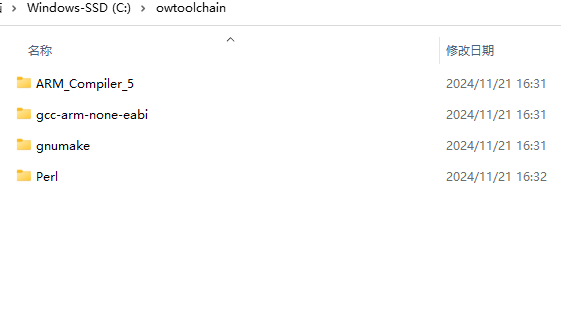

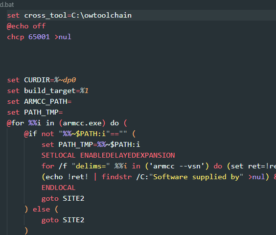

## About the project path

Please note that the project save path cannot contain spaces. Otherwise, the firmware won't be able to be downloaded to the device after successful compilation.

## Set Device Type

- Open the project directory, enter the demo directory, double-click project_build.bat

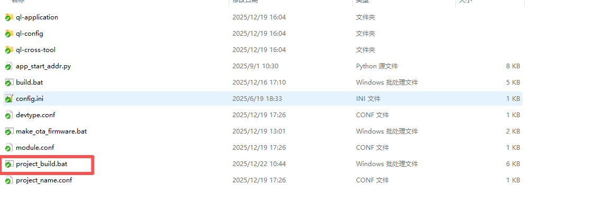

- After running the script, the following window will prompt.

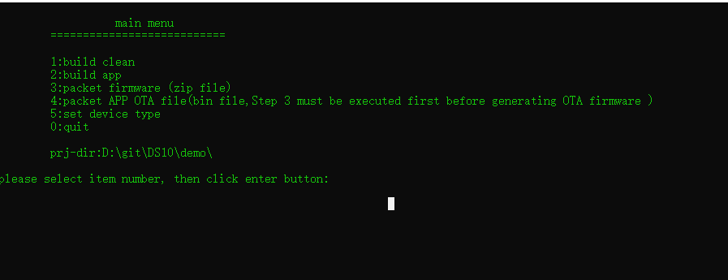

- Set the device type and enter the number 5 in the newly popped up window

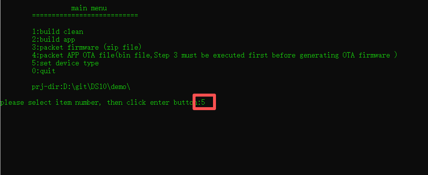

- Choose different types based on your device type
  
  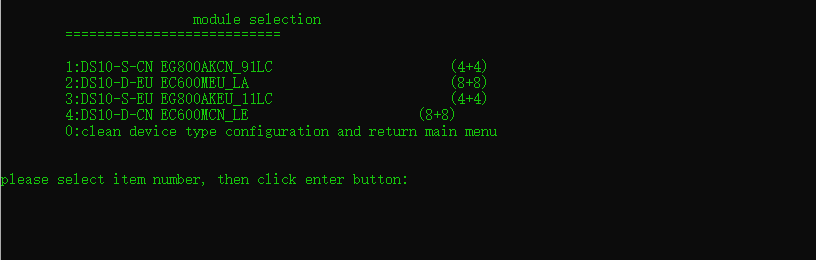
  
  Taking DS10-S-CN as an example, enter the number 1 and press the confirm button

- Device type setting successful
  
  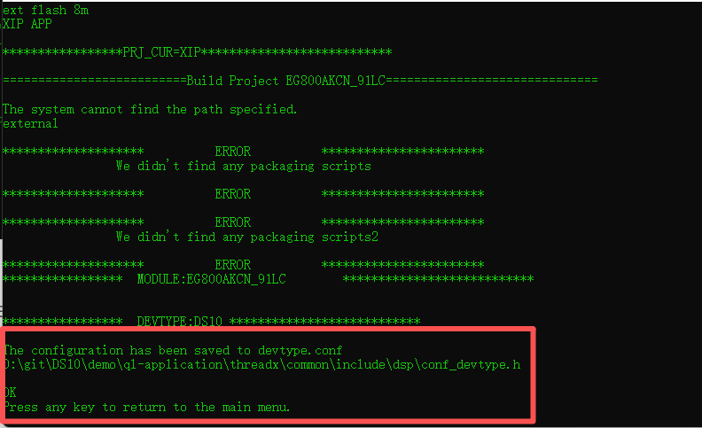

- Continue pressing the enter key.After entering the menu again, it indicates that the configuration has been completed

## Start Building

- If the first compilation, you should select 1option to clean the project to avoid leaving any other compiled information.

- Enter 2 to build the app
  
  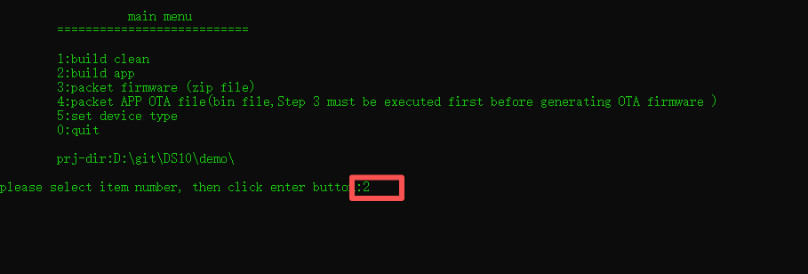
  
  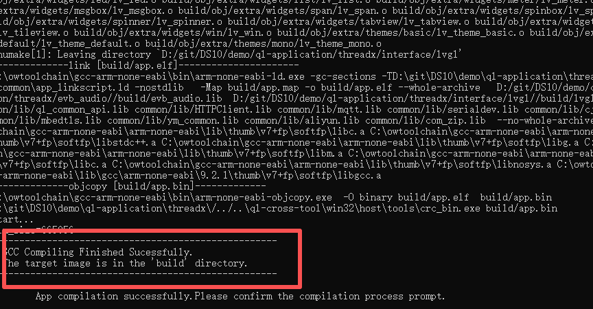
  
  The above information indicates that the compilation was successful.

- Select 3 option to packet firmware.

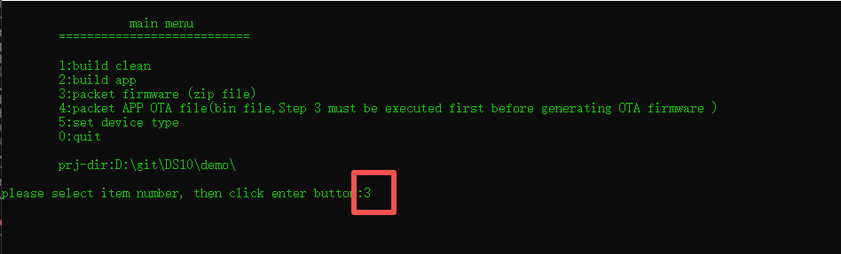

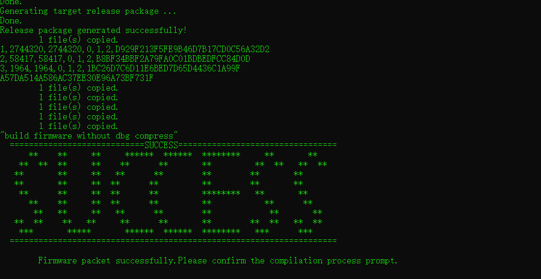

The above information indicates that the firmware has been successfully packaged.
 The firmware file will be available. Generate a zip format firmware package under **demo\target\DS10_4GW_V071502_100_R07A15_EG800AKCN_91LC**

## Firmware Download

- Run tool/download_tool/QMulti_SL_V2.6/QMulti_SL_V2.6.exe.Select the generated firmware package.

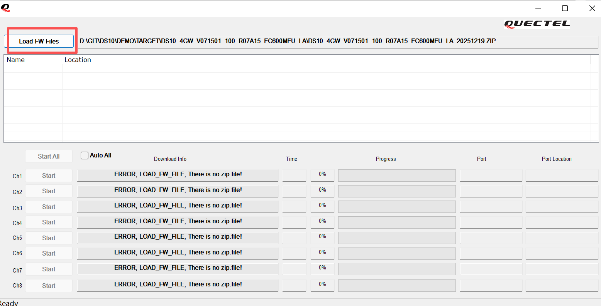

- When the device is turned off, insert the USB cable and press the power button. The tool will detect the device status and start firmware download.
  
  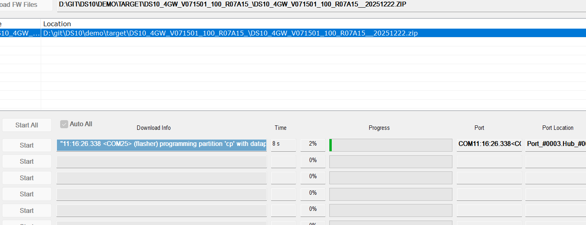

- Firmware download success

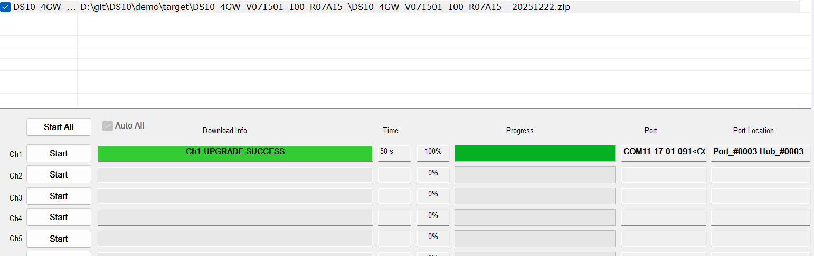

- Close the download tool and unplug the USB first, then press the power button to turn on the device, and the new firmware will run (**Please note that the download tool must be closed, otherwise the device will auto enter download mode again**)

## Generate OTA firmware

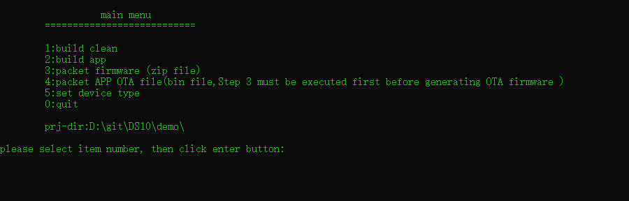

You need to follow steps 2, 3, and 4 in sequence.

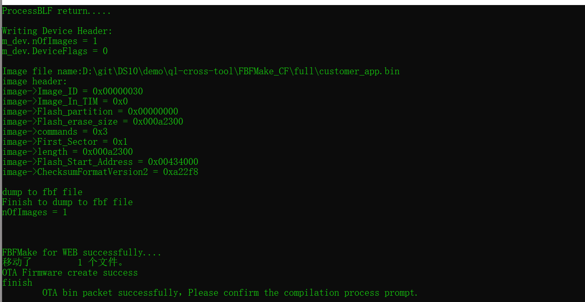

After the fourth step is successfully executed, OTA firmware will be generated in the current directory of the script. It is a bin file.

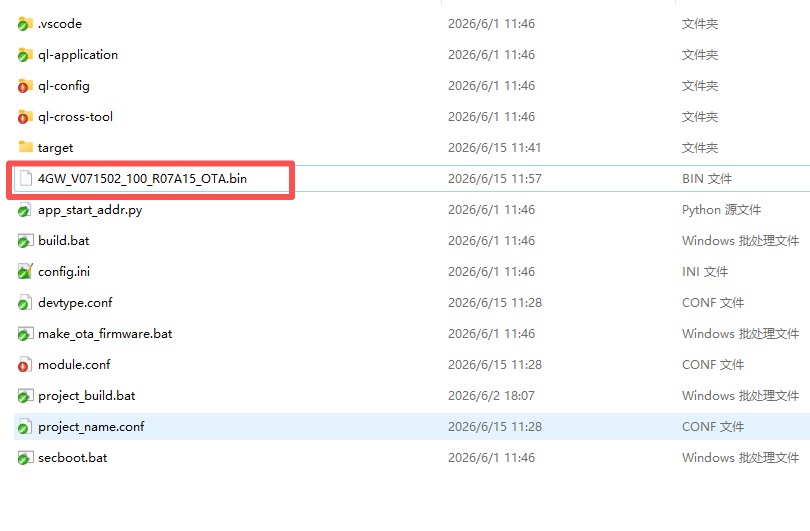

OTA firmware can be updated through TMS.

## How to create ota package and Use TMS

[Click here to get more detail](./How to create ota package.md)
